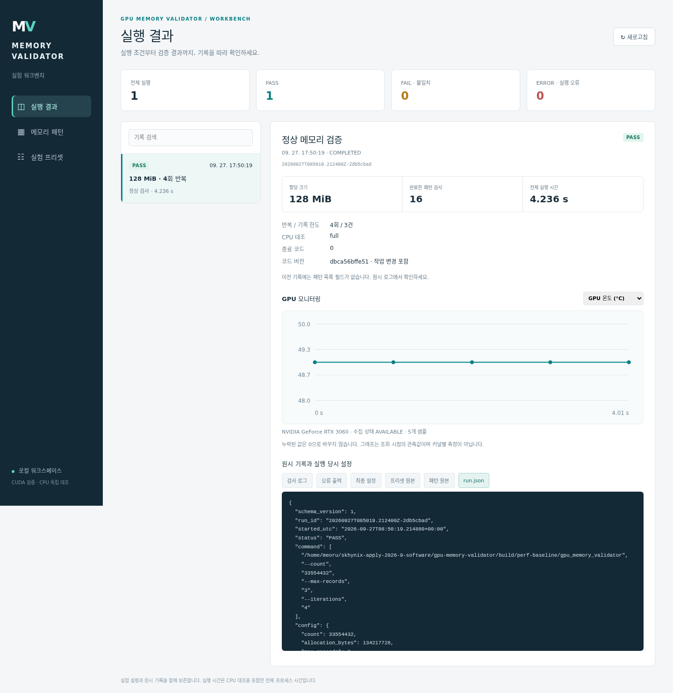

# GPU Memory Validator

CUDA 기반 GPU 메모리 검증·오류 분석 도구다. 할당한 메모리에 32비트 상수·위치·seed 패턴을 쓰고,
GPU에서 불일치를 검출한 뒤 전체 데이터를 CPU로 복사해 오류 개수와 상세 기록을 독립 대조한다.  
Python 실행기는 실험 조건·환경·코드·원시 결과를 보존하고, 로컬 GUI는 설정 편집과 결과 조회를 제공한다.  

## 주요 기능

- 사용자 지정 상수·index·seeded 패턴, 검사 크기·반복 횟수·상세 기록 한도 설정.
- GPU 반복 읽기 검사와 CPU 전체 대조 체크포인트, 최초 실패 회차·진행 기록 보존.
- 검사 사이 비트 반전·재검사, 오류 발생 후 쓰기 중단과 실패 시점의 데이터 보존.
- XOR 오류 주입, 전체 오류 수와 최대 K건 기록, 기록 잘림 표시.
- CPU 전체 대조와 PASS/FAIL/ERROR 구분, GPU 자원 정리 및 완료된 부분 결과 보존.
- 패턴/프리셋 JSON, 실행 당시 입력 사본·소스/실행 파일 SHA256·로그·GPU 지표 저장.
- 패턴/프리셋 편집과 개별 실험 결과 조회 GUI.
- 계층별 자동 테스트, 호스트 버퍼 재사용 성능 비교, 별도 PyTorch 장치 오류 실습.
- PyTorch 사용자 CUDA 연산의 stride 결함 재현·수정, stream·추론 통합 검사와 비용 비교.

## 빌드와 첫 실행

아래 명령은 저장소 루트에서 실행한다. Linux/WSL, C++17 컴파일러, CMake 3.18 이상,  
Python 3.10 이상, NVIDIA GPU·드라이버·CUDA Toolkit이 필요하다.  
확인 환경은 WSL2 Ubuntu 22.04, RTX 3060, NVCC 12.8.93, GCC 11.4다.  

```bash
# 이 작업 공간의 사용자 경로에 CUDA 도구가 설치되어 있을 때
source cuda-env.sh
cmake -S . -B build/cuda -DGMV_ENABLE_CUDA=ON \
  -DCMAKE_BUILD_TYPE=Release -DCMAKE_CUDA_ARCHITECTURES=86
cmake --build build/cuda -j 4

# 기본 네 패턴, 1,025개 원소 검사
./build/cuda/gpu_memory_validator

# 오류 3건을 주입하고 상세는 최대 2건 기록
./build/cuda/gpu_memory_validator --count 1025 --max-records 2 --inject
```

`cuda-env.sh`는 `~/.local/opt/cuda-12.8.1-minimal`을 사용한다. 해당 설치가 없다면  
`scripts/setup_cuda.py`로 준비하거나, 이미 설치한 Toolkit 경로를 CMake에 지정한다.  
다른 GPU에서는 `CMAKE_CUDA_ARCHITECTURES`를 해당 장비에 맞춘다.  

| 결과 | 종료 코드 | 의미 |
|---|---:|---|
| PASS | 0 | 검사와 CPU 대조 완료, 불일치 없음 |
| FAIL | 1 | 데이터 불일치 검출; `--inject`의 예상 결과 |
| ERROR | 2 | 입력·CUDA 실행·CPU 대조 등 오류 |

## 실험 저장과 GUI

```bash
python3 scripts/run_experiment.py --profile profiles/128mib-normal.json
python3 scripts/run_experiment.py --profile profiles/custom-smoke.json --inject
python3 scripts/workbench.py
```

실험은 출력된 `run_dir`에 저장한다. GUI는 http://127.0.0.1:8765 에서 연다.  
패턴/프리셋 저장 → 실행 명령 복사 → 터미널 실행 → GUI 새로고침 순서로 사용한다.  



실제 128 MiB 실험 기록을 복사한 테스트 공간의 화면이다.  

## 문서

| 문서 | 내용 |
|---|---|
| [제출 버전 확인](docs/RELEASE.md) | 검증한 코드 버전, 전체 재검사 결과와 제출 범위 |
| [입력 설정](docs/INPUTS.md) | CLI 옵션, 패턴/프리셋 JSON, 우선순위와 경로 |
| [실험 실행](docs/EXPERIMENTS.md) | 저장 파일, 중단·시간 초과, 지표와 시간 해석 |
| [GUI 사용법](docs/GUI.md) | 설정 편집·저장·결과 조회 |
| [구조와 검증 동작](docs/PROJECT.md) | 모듈 책임, CPU 대조, 오류·자원 관리 |
| [테스트](docs/TESTING.md) | 실행 명령, 검사 범위, 검증 한계 |
| [성능 비교](docs/PERFORMANCE.md) | 동일 조건의 측정 결과와 재현 방법 |
| [지속 읽기 부하](docs/LOAD.md) | GPU 반복 검사, 중간 오류 보존, 부하 측정과 해석 |
| [읽기·반전 검사](docs/INVERT.md) | 값 반전, 회차별 기대값, 실패 데이터 보존과 실행 |
| [DCGM 실습과 검증 범위](docs/DCGM.md) | 실제 진단 결과, 보완한 범위와 남은 한계 |
| [PyTorch 실습](docs/PYTORCH.md) | 장치 오류 재현·수정과 수치 대조 |
| [PyTorch–CUDA 배치 디버깅](docs/LAYOUT.md) | 전치·슬라이스 오류, 두 수정 방식, stream·추론 검사와 측정 |
| [검증 기록](results/README.md) | 대표 결과와 원시 증거 |
