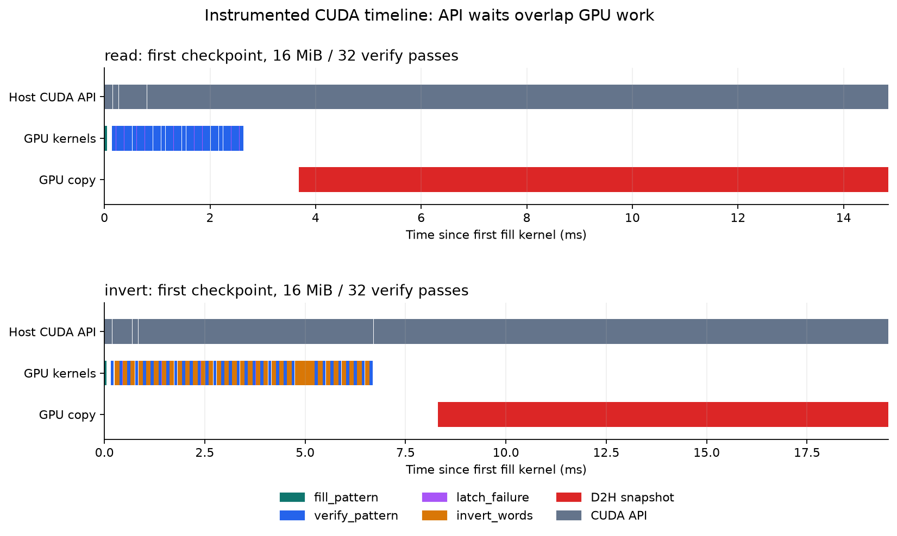

# 메모리 접근 검사와 CUDA 실행 분석

RTX 3060 / Windows 드라이버 591.86 / WSL2에서 Compute Sanitizer와 Nsight Systems로
검증 코어를 검사한다. Windows 호스트의 디버깅 인터페이스를 활성화한 뒤 WSL에서 실행했으며,
Windows 네이티브 CUDA 프로그램을 별도로 빌드한 결과는 아니다.

## 서로 다른 검증의 역할

Compute Sanitizer 2025.1.0.0(CUDA 12.8.1 배포본)의 memcheck와 CPU 정답 대조를 함께 실행했다.
진단 예제는 검증 코어와 별도 실행 파일이며, 의도적 결함은 소프트웨어 오류 재현이다.

| 사례 | CPU 정답 대조 | memcheck | 의미 |
|---|---|---|---|
| 정상 복사 | PASS, 불일치 0 | 접근 오류 0 | 두 검사 모두 통과 |
| 배열 바로 뒤에 쓰기 | PASS, 불일치 0 | 잘못된 global 쓰기 1건, 소스 위치 확인 | 검사 대상 출력이 맞아도 잘못된 접근이 존재할 수 있음 |
| 전치 입력의 stride 무시 | FAIL, 불일치 10 | 접근 오류 0 | 유효한 저장소 안에서 틀린 위치를 읽는 논리 오류 |
| stride 수정 | PASS, 불일치 0 | 접근 오류 0 | 논리적 주소 계산 수정 확인 |

배열 밖 쓰기는 memcheck의 `--destroy-on-device-error kernel` 아래 별도 프로세스에서 실행한다.
정상 출력 커널 뒤에 결함 커널을 실행하므로 출력은 보존되고 결함 커널의 접근이 보고된다.
검사 없이 실행했을 때의 동작을 보장하거나, 실제 메모리 불량을 재현하는 예제가 아니다.

기존 검증기는 세 패턴×읽기/반전×정상/주입 **12조건**에서 접근 오류 0건을 확인했다.
조건은 257원소, 두 패턴 값×2회 반복, GPU 3회 검사, 기록 한도 2건, 주입 회차 2다.
주입 시 프로그램은 FAIL/종료 1을 유지하며 memcheck의 접근 오류 여부와 구분한다.
실행기는 종료 코드뿐 아니라 프로그램 결과와 도구의 오류 요약·오류 위치까지 확인한다.

[16개 대조 검사와 원시 로그](../results/20260928T012312.702938Z-sanitizer-validation/run.json).
동일 빌드에서 기존 CTest 46개도 통과했다. PyTorch 확장에 대한 Sanitizer 검사,
racecheck/initcheck/synccheck, 모든 입력과 메모리 결함 유형을 검사한 것은 아니다.

## 실행 방법

저장소 루트에서 실행한다. 의도적 결함 예제는 기본 빌드에서 제외하고 명시적으로 활성화한다.

```bash
source cuda-env.sh
cmake -S . -B build/cuda -DGMV_ENABLE_CUDA=ON \
  -DGMV_BUILD_DIAGNOSTIC_LABS=ON -DCMAKE_BUILD_TYPE=Release
cmake --build build/cuda -j 4
python3 experiments/sanitizer/check.py
```

WSL에서 `Failed to initialize WDDM debugger interface`가 나오면 Windows 호스트의
`HKLM\SOFTWARE\NVIDIA Corporation\GPUDebugger\EnableInterface`를 확인한다.
이 장비에서는 해당 값이 없었고, 관리자 PowerShell에서 DWORD 1로 설정한 뒤 같은 프로그램의
memcheck가 정상 실행됐다. 드라이버 설치·TDR 설정 변경·재부팅은 수행하지 않았다.

```powershell
# Windows 관리자 PowerShell. 기존 값이 있으면 먼저 기록한다.
$p = 'HKLM:\SOFTWARE\NVIDIA Corporation\GPUDebugger'
New-Item -Path $p -Force | Out-Null
New-ItemProperty -LiteralPath $p -Name EnableInterface -PropertyType DWord -Value 1 -Force

# 이 장비의 원래 상태(값 없음)로 복원할 때
Remove-ItemProperty -LiteralPath $p -Name EnableInterface
```

[변경 전후 설정·동일 프로그램 재검사](../results/20260928T011255.302384Z-debugger-interface/run.json).
설정은 현재 활성화된 상태로 남아 있다. 다른 장비의 기존 값을 무조건 제거하는 복원 절차는 아니다.
[NVIDIA Windows 디버깅 인터페이스 요구사항](https://docs.nvidia.com/compute-sanitizer/ComputeSanitizer/index.html#windows-specific-behavior).

## Nsight Systems 타임라인

Nsight Systems 2026.3.2를 SHA256으로 확인한 공식 패키지에서 로컬 추출한다.
CUDA API·GPU 커널·메모리 복사를 수집하며 CPU 샘플링·OS 스케줄링·CUDA event 추가 추적은 끈다.
이 실험은 CPU 함수별 비용이나 WDDM 스케줄러를 분석한 결과가 아니다.

```bash
python3 experiments/sanitizer/setup_nsight.py
python3 experiments/sanitizer/profile.py
# 위 명령이 출력한 결과 디렉터리를 사용한다.
python3 experiments/sanitizer/check_trace_analysis.py results/<실행폴더>
build/plot-env/bin/python experiments/sanitizer/plot_timeline.py results/<실행폴더>
```

그림 환경은 [성능 그림 환경](PERFORMANCE.md)을 사용한다. 원본 `.nsys-rep`는 Nsight Systems GUI에서
열 수 있고, SQLite와 집계 JSON도 함께 보존한다. 분석기는 파일 생성이나 종료 0만으로 성공 처리하지 않는다.
커널·Runtime API·복사 이벤트의 존재, 커널 순서·횟수, 단일 stream, 전체 복사 시점을 확인한다.
원본 복사본에서 이벤트를 제거하는 대조 검사 5개로 불완전한 수집 결과의 거부를 확인했다.

두 실행 모두 16 MiB, seeded 두 값×2회 반복, 각 CPU 체크포인트 전 GPU 검사 32회다.

| 모드 | fill | verify | latch | invert | 전체 D2H 복사 |
|---|---:|---:|---:|---:|---:|
| read | 4 | 128 | 128 | 0 | 16 MiB×4회 |
| invert | 4 | 128 | 128 | 124 | 16 MiB×4회 |

CPU 대조는 각 모드 4회 모두 PASS이며, GPU에서 마지막 latch가 완료된 뒤 스냅샷을 복사하고
복사가 끝난 뒤 다음 패턴의 fill이 실행되는 것을 확인했다.



Host CUDA API 구간에는 GPU 완료 대기가 포함되어 GPU 작업과 겹친다. 따라서 두 구간을 더해
전체 시간을 계산하면 중복된다. 복사 이벤트와 커널 실행 시간을 구분할 수 있지만, 프로파일링
부하가 있는 짧은 단일 실행이므로 성능 개선율·메모리 대역폭이나 장기 안정성의 근거로 쓰지 않는다.
Unified Memory 추적 제한 경고는 보존했으며 이 실험은 cudaMalloc/cudaMemcpy를 사용한다.

[실행 조건·명령·해시·원본](../results/20260928T012317.524493Z-cuda-timeline/run.json),
[읽기 집계](../results/20260928T012317.524493Z-cuda-timeline/read-summary.json),
[반전 집계](../results/20260928T012317.524493Z-cuda-timeline/invert-summary.json),
[수집 누락 거부 검사](../results/20260928T012317.524493Z-cuda-timeline/analysis-controls.json).

이 결과는 CUDA 프로그램의 접근 정확성과 실행 흐름 분석을 보여준다. BIOS·펌웨어 분석,
드라이버 내부 수정, 실제 GPU 물리 불량 규명, DCGM 고급 진단 통과를 의미하지 않는다.
