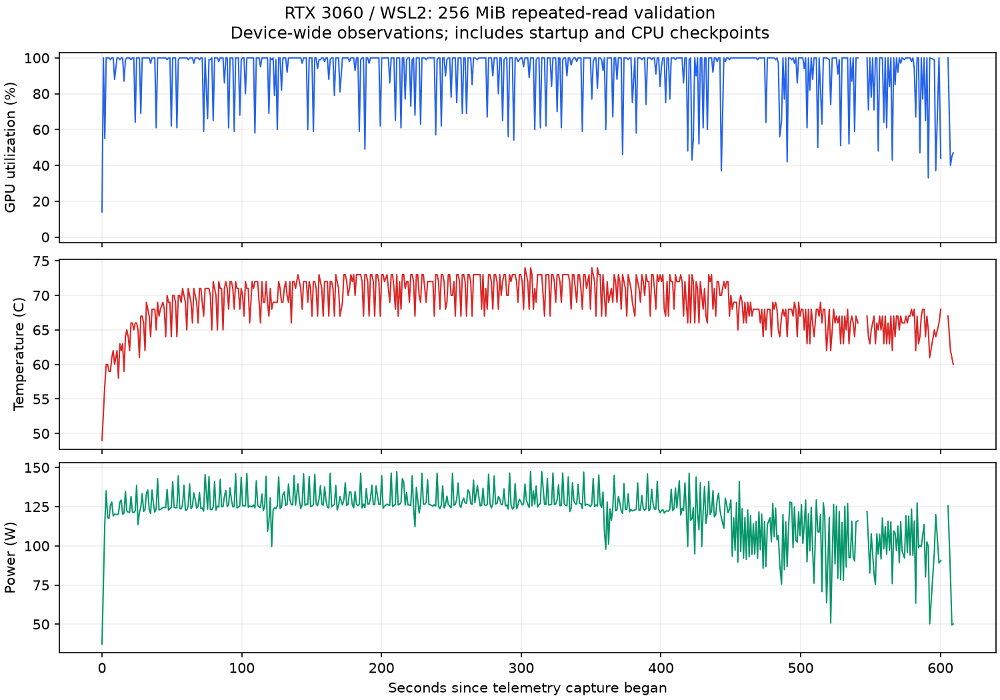

# GPU 반복 읽기 부하와 CPU 체크포인트

GPU에서 메모리를 반복해서 읽고 검사하되, CPU 독립 대조는 묶음 끝에서 수행한다.
단일 GPU의 반복 읽기 워크로드이며 종합적인 메모리·전력·연산 스트레스 도구는 아니다.

## 구조와 검사 범위

| 설정 | GPU 동작 | CPU 대조 |
|---|---|---|
| gpu_passes=1 | fill → verify | 매 검사 후 전체 스냅샷 |
| gpu_passes=N | fill → (verify → 실패 회차 고정) × N | 묶음 종료 후 전체 스냅샷 |

GPU 반복 중 전체 배열 복사나 CPU 대조를 하지 않는다. 오류를 발견한 첫 회차를 고정한 뒤
나머지 verify 커널은 데이터를 읽지 않고 종료한다. 카운터와 기록은 처음 실패한 회차의 값이다.
같은 오류를 N번 세지 않으며 실패 후 데이터가 새 패턴으로 덮이기 전에 CPU가 확인한다.

검사 커널에서 `error_count != 0`만 보고 곧바로 종료하면 같은 회차의 뒤늦게 실행된 thread가
오류를 보고하지 못할 수 있다. 별도 latch 커널이 모든 thread의 검사 완료 후 실패를 고정한다.
같은 stream에 제출한 커널의 실행 순서를 이용하며, 검사 중에는 latch를 변경하지 않는다.
[NVIDIA stream 순서 문서](https://docs.nvidia.com/cuda/cuda-programming-guide/02-basics/asynchronous-execution.html)

CPU는 체크포인트 시점의 전체 데이터·오류 개수·상세 기록을 독립 대조한다. 중간 N회 각각의
스냅샷을 CPU가 확인하는 것은 아니다. GPU와 CPU 판단이 다르면 ERROR이며, 이후 정상 묶음이
나와도 앞선 FAIL을 지우지 않는다. 패턴·반복 사이에는 카운터와 latch를 초기화한다.

`iterations`는 패턴 목록의 반복, `gpu_passes`는 한 패턴을 채운 뒤의 GPU 읽기 검사 횟수다.
예를 들어 2개 패턴×200회×1,024 GPU 검사는 CPU 체크포인트 400회에 대응한다.
오류로 멈춘 묶음은 `gpu_passes_completed`에 실제 검사 회차를 기록한다.

## 실행

저장소 루트에서 [빌드](../README.md#빌드와-첫-실행)한 뒤 실행한다.

```bash
source cuda-env.sh
# 정상 및 중간 회차 주입: 짧은 기능 확인
python3 scripts/run_experiment.py --profile profiles/load-smoke.json
python3 scripts/run_experiment.py --profile profiles/load-smoke.json --inject

# 256 MiB, 두 seed, 200회 반복, 각 묶음에서 1024회 GPU 검사
python3 scripts/run_experiment.py --profile profiles/load-256mib.json

# 실제 GPU 경계·중간 주입·타임아웃·중단 검사
python3 tests/cli/test_load.py
```

load-smoke 주입은 7회 중 4회차에서 오류 3건, GPU 상세 최대 2건을 남긴다.
첫 묶음의 `gpu_passes_completed=4`, `first_failed_pass=4`, 최종 상태 FAIL/종료 1이 예상 결과다.
이후 묶음은 7회를 완료한다. 주입 없는 실행은 PASS/종료 0이다.

256 MiB 프리셋은 고정 작업량이며 실행 시간을 보장하지 않는다. 900초 제한을 넘으면 ERROR다.
CPU 독립 대조를 생략한 실행과 정확성·성능을 동등하게 비교하지 않는다.

## 로그와 시간

`checkpoint iteration=... completed_patterns=... cumulative_status=...`는 CPU 대조 후 즉시 출력한다.
최종 보고에는 각 묶음의 결과와 최초 실패 회차를 담는다. 시간 초과나 Ctrl+C로 종료하면 진행
기록이 남더라도 전체 상태는 ERROR다. 완료 요약 없이 PASS로 간주하지 않는다.
강제 중단 시 상세 오류 내용은 아직 출력되지 않았을 수 있다.

- `gpu_phase_host_ms`: fill, verify/latch 제출과 GPU 완료 대기까지 호스트에서 측정.
- `cpu_phase_host_ms`: 오류 정보·전체 배열 복사와 CPU 대조를 호스트에서 측정.
- `process_elapsed_seconds`: 초기화·해제·출력까지 포함한 실행기 관측 시간.
- `telemetry.jsonl`: 온도·전력·클록·GPU/메모리 사용률의 주기적 관측값.

GPU 구간 시간은 CUDA event를 이용한 순수 커널 시간이 아니며, 사용률도 프로세스별 사용률이
아니다. 반복해서 읽은 논리 바이트 수는 실제 DRAM 버스 전송량이나 대역폭 측정값이 아니다.

## 실제 관측 결과

RTX 3060 12 GiB / WSL2, Release 빌드 `e370410`에서 실행했다. 검사 영역은 256 MiB,
패턴 방식은 seeded, seed는 `12345678`과 `deadbeef`다.

| 항목 | 정상 실행 |
|---|---:|
| 설정 | 두 패턴 × 200회 반복 × 1,024 GPU 검사 |
| 실행기 관측 시간 | 609.94초, 약 10분 10초 |
| GPU 검사 완료 | 409,600회 |
| CPU 전체 대조 | 400회, 모두 PASS |
| 최종 결과 | PASS / COMPLETED / 종료 0 |
| 지표 수집 | 581회 중 성공 579회, 조회 시간 초과 2회; PARTIAL |
| GPU 사용률 | 유효 표본 중앙값 100%, 산술 평균 92.9%, 범위 14~100% |
| 온도 | 중앙값 69°C, 범위 49~74°C |
| 전력 | 중앙값 125.13 W, 범위 37.35~147.50 W |

지표 통계는 시작·종료 구간을 포함한 유효 표본 기준이며 시간 가중 평균이 아니다.
공유 GPU 전체 관측으로 이 프로세스만의 부하라고 단정하지 않는다. 지표 누락은 검증 결과와
별도로 보존했으며, 아래 그래프에서도 결측 구간을 연결하지 않는다.
호스트에서 측정한 GPU 구간 합은 463.06초, 복사·CPU 대조 구간 합은 145.50초다.
이를 순수 GPU 커널 시간이나 GPU 사용률로 해석하지 않는다.



[정상 실행·조건·버전](../results/20260927T133107.035927Z-8000d7a5-experiment/run.json),
[검사 및 지표 요약](../results/20260927T133107.035927Z-8000d7a5-experiment/summary.json).

별도 오류 대조 실행은 같은 크기·seed·1,024회 설정에서 반복을 2회로 줄이고, 첫 묶음의
512회차에 XOR 오류 3건을 주입했다. `first_failed_pass=512`, CPU/GPU 오류 수 각각 3,
상세 3건, CPU 독립 대조 PASS를 확인했다. 후속 세 묶음은 각각 1,024회 검사를 완료했고
전체 결과는 FAIL/종료 1을 유지했다. 실제 시간 29.03초이며 성능 비교용 실행이 아니다.
[주입 실행](../results/20260927T134128.392697Z-f4c9c0fb-experiment/run.json),
[원시 오류 기록](../results/20260927T134128.392697Z-f4c9c0fb-experiment/stdout.txt).

```bash
python3 scripts/run_experiment.py --profile profiles/load-256mib.json \
  --iterations 2 --inject --inject-pass 512

# 저장된 로그의 독립 검사와 통계 재계산; 저장소 루트에서 실행
python3 results/20260927T133107.035927Z-8000d7a5-experiment/summarize_load.py \
  results/20260927T133107.035927Z-8000d7a5-experiment
```

요약 스크립트는 테스트의 독립 출력 검사기를 사용한다. 그래프 재생성 스크립트는 같은 폴더의
`plot_load.py`이며 [성능 그림 환경](PERFORMANCE.md)의 Matplotlib을 사용한다.
정상 및 주입 실행 모두 조건·소스 사본·바이너리 해시·원시 로그를 보존했다.
한 번의 약 10분 실행으로 장기 안정성이나 모든 결함의 검출을 입증한 것은 아니다.

## 한계

256 MiB는 할당한 검사 영역이며 12 GiB VRAM 전체가 아니다. 같은 패턴을 반복해서 읽는 검사로,
매번 반전·쓰기·block move·retention 대기 등을 수행하지 않는다. 중간의 일시적인 오류를 GPU가
놓치고 체크포인트 전에 값이 복원되면 CPU 대조도 이를 관측하지 못할 수 있다.
WSL·공유 디스플레이 GPU의 특정 조건에 대한 관측으로 하드웨어 무결성 인증, HBM 검증,
ECC/XID 수집, DCGM 고급 진단 통과를 주장하지 않는다. [DCGM 비교](DCGM.md)를 참고한다.
