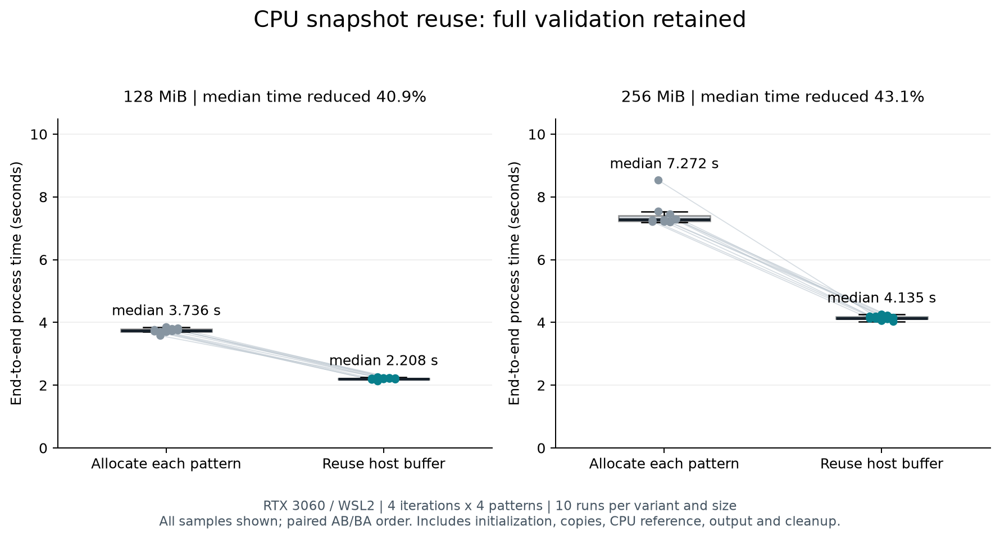

# CPU 대조 버퍼 재사용 실험

2026-09-27. GPU 검사와 CPU 전체 대조를 유지하면서 CPU 스냅샷 버퍼의 반복 할당을 줄인다.
실험 범위는 동일 조건에서 한 변경의 영향을 비교하는 것이며 순수 GPU 대역폭 측정은 아니다.

## 가설과 변경

기준 버전은 각 패턴마다 `std::vector<uint32_t> host_data(count)`를 생성한다.
이 생성자는 count개 원소를 할당하고 0으로 초기화한다. 바로 다음 `cudaMemcpy`가
전체 버퍼를 덮어쓰므로, 반복되는 할당·초기화가 검사 결과에 필요한 작업인지 확인했다.

변경 버전은 두 반복문 밖에서 버퍼를 한 번 생성하고 재사용한다.

```cpp
// 이전: 4 iterations × 4 patterns = 큰 host 버퍼 생성 16회
for (iteration ...) {
    for (pattern ...) {
        std::vector<std::uint32_t> host_data(count);
        cudaMemcpy(host_data.data(), device_data.get(), bytes, cudaMemcpyDeviceToHost);
        check_reference(host_data, ...);
    }
}

// 변경: 같은 실행에서 큰 host 버퍼 생성 1회
std::vector<std::uint32_t> host_data(count);
for (iteration ...) {
    for (pattern ...) {
        cudaMemcpy(host_data.data(), device_data.get(), bytes, cudaMemcpyDeviceToHost);
        check_reference(host_data, ...);
    }
}
```

두 코드 블록은 변경 설명을 위한 축약이다. 실제 코드는 모든 복사 호출의 오류를 확인한다.
전체 복사가 성공한 경우에만 CPU가 원소를 대조하므로 이전 패턴의 값으로 검사하지 않는다.
복사 실패 시에는 ERROR로 종료하며 해당 패턴을 완료한 결과로 기록하지 않는다.

GPU fill/injection/verify, 복사량, CPU 전체 대조, 오류 개수·기록 검증, 출력은 동일하다.
CPU 대조 내부의 중복 검사 버퍼와 GPU 버퍼 관리는 이번에 변경하지 않았다.

## 비교 방법

- 기준 버전: `dbca56b`; 변경 버전: `5336495`.
- 같은 PC의 RTX 3060, WSL2, CUDA NVCC 12.8.93, GCC 11.4.0.
- 두 버전 모두 CMake Release, `-O3 -DNDEBUG`, CUDA architecture 86.
- 메모리 128 MiB와 256 MiB; 네 상수 패턴 × 4회 반복, K=3, CPU 전체 대조, 주입 비활성.
- 각 크기/버전의 준비 실행 1회는 통계에서 제외한다. 이후 각 버전을 10회씩 실행한다.
- 같은 쌍 안에서 기존→변경, 다음 쌍에서 변경→기존으로 순서를 교대한다. 느린 표본도 제외하지 않는다.
- 각 실행은 새 프로세스다. wall time은 시작부터 종료까지이며 CUDA 초기화·할당·복사·CPU 대조·출력·해제를 포함한다.
- 표본마다 CPU user/system 시간과 minor page fault 차이를 기록한다. 이 page fault는 OS 메모리 관리 지표로,
  GPU 메모리 불량이나 validator가 발견한 오류 개수가 아니다.
- GPU 온도·전력·클록·여유 메모리는 측정 구간 밖에서 각 쌍 전후에 조회한다.
- 커널별 CUDA event 시간은 이번에 측정하지 않았다. 커널 시간/대역폭 개선으로 표현하지 않는다.

## 관측 결과

측정 40회와 준비 실행 4회가 모두 정확성 검사를 통과했다. 다음 수치는 준비 실행을 제외한 각 10회 표본이다.

| 할당 크기 | 기존 중앙값 | 변경 중앙값 | 시간 감소 | 기존 Q1–Q3 | 변경 Q1–Q3 |
|---|---:|---:|---:|---:|---:|
| 128 MiB | 3.736s | 2.208s | 40.9% | 3.702–3.783s | 2.187–2.223s |
| 256 MiB | 7.272s | 4.135s | 43.1% | 7.220–7.404s | 4.108–4.189s |

시간 감소율 = (기존 중앙값 − 변경 중앙값) / 기존 중앙값 × 100.
256 MiB 기준 버전에 8.529초 표본이 있었으며 제거하지 않았다. 모든 점을 아래 그림에 표시했다.



기준/변경 간 검사 코드의 차이는 host_data 할당 위치뿐이다. OS minor page fault 중앙값은
128 MiB에서 549,652→58,116, 256 MiB에서 1,075,987.5→92,932로 감소했다.
system CPU 시간 중앙값도 각각 1.429→0.242초, 2.898→0.445초로 감소했다.
이 관측은 반복 할당·초기화의 호스트 메모리 관리 비용을 줄였다는 해석을 뒷받침한다.
검사 구간별 프로파일링은 수행하지 않았으므로 전체 비용을 특정 내부 함수에 정확히 배분하지는 않는다.

쌍 전후 관측 온도는 50–52°C, SM 클록은 1927MHz였다. 구간 내부의 변화까지 확인한 값은 아니다.
[원시 결과 및 조건](../results/20260927T085149.505158Z-host-buffer-comparison/run.json),
[표본 CSV](../results/20260927T085149.505158Z-host-buffer-comparison/samples.csv),
[독립 그림 PDF](../results/20260927T085149.505158Z-host-buffer-comparison/comparison.pdf)를 보존했다.

## 정확성 근거

변경 후 CPU 단위 25개, 런타임·버퍼 10개, CLI 26개가 통과했다.
주입 이후 정상 패턴/반복의 대조, 기록 한도, 부분 실패 보존, 자원 해제를 기존 회귀 검사로 확인했다.
성능 표본도 종료 코드만 확인하지 않고 독립 CLI 검사 함수로 각 패턴의 값·CPU/GPU 오류 개수·기록·
대조 결과·완료 횟수·최종 상태를 확인한다. 성능 표본은 모두 정상 입력이다.
별도 큰 배열의 오류 주입 결과는 실행 기록 목록에 보존한다.

## 재현

다음 명령은 기준 소스가 아직 없는 새 체크아웃 기준이다. 현재 작업 공간에는 기준 빌드가 이미 있다.

```bash
source cuda-env.sh
git worktree add --detach build/perf-baseline-source dbca56b
cmake -S build/perf-baseline-source -B build/perf-baseline \
  -DGMV_ENABLE_CUDA=ON -DCMAKE_BUILD_TYPE=Release -DCMAKE_CUDA_ARCHITECTURES=86
cmake --build build/perf-baseline -j 4
cmake -S . -B build/cuda \
  -DGMV_ENABLE_CUDA=ON -DCMAKE_BUILD_TYPE=Release -DCMAKE_CUDA_ARCHITECTURES=86
cmake --build build/cuda -j 4
python3 benchmarks/compare_host_buffer.py --samples 10 --iterations 4
```

과거 수치를 정확히 재현하려면 변경 버전도 `5336495`로 체크아웃하여 별도 빌드한다.
이후 기능이 추가된 현재 버전과 비교하면 새로운 실험이다. 비교 스크립트는 각각의 소스·해시·
실행 파일 해시·CMake cache·컴파일러 버전·원시 출력을 결과 폴더에 남긴다.

## 해석 범위

공유 GPU/WSL 환경의 단일 PC에서 수행한 비교다. 온도·다른 프로세스·드라이버 등의 영향을
완전히 통제한 벤치마크나 장시간 안정성 시험은 아니다. 검사 작업량을 유지한 처리 시간 변화만
보고한다. 128/256 MiB가 동시에 사용하는 할당 크기이며 반복 검사량과 물리 VRAM 범위를 구분한다.

## 그림 다시 생성

그래프 패키지는 검증 실행에 필요하지 않으며 별도 가상 환경에서 사용한다.
측정이 끝난 뒤 설치·실행하여 측정 중 CPU/메모리 부하에 영향을 주지 않았다.

```bash
python3 -m venv build/plot-env
build/plot-env/bin/python -m pip install -r benchmarks/requirements-plot.txt
build/plot-env/bin/python benchmarks/plot_comparison.py \
  results/20260927T085149.505158Z-host-buffer-comparison/run.json
```
