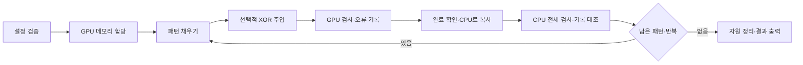

# 구조와 검증 동작

## 구성

| 모듈 | 책임 |
|---|---|
| `src/main.cpp` | 설정 읽기 → 검증 → 출력 → 종료 코드 |
| `src/cli.cpp` | 입력 파싱·범위 검사 |
| `src/validator.cu` | GPU 버퍼 소유, 커널 실행, 반복별 결과 수집 |
| `src/reference.cpp` | CPU 전체 검사와 GPU 오류 기록 대조; CUDA API에 독립 |
| `src/report.cpp` | 이미 판정한 상태와 결과 출력 |
| `include/gmv/` | 공유 자료형·인터페이스·자원 관리 |
| `scripts/experiment_config.py` | CLI/GUI 공통 JSON 검증과 설정 해석 |
| `scripts/run_experiment.py` | 프로세스 실행·중단·환경/입력/로그/지표 보존 |
| `scripts/workbench.py`, `web/` | 로컬 설정 편집과 저장된 결과 조회 |
| `tests/` | CPU·GPU·CLI·실행기·GUI·PyTorch 검사 |
| `benchmarks/` | 동일 작업량의 성능 비교와 그림 생성 |
| `experiments/pytorch/` | PyTorch 장치 오류 재현·수치 대조 |
| `experiments/pytorch/relu_layout.cu` | PyTorch 사용자 CUDA 연산·stride·device/stream 계약 |
| `examples/first_kernel.cu` | 단일 파일의 기본 CUDA 예제 |

## 검사 흐름

아래는 기본 모드(`gpu_passes=1`)의 흐름이다. GPU 반복 모드는 뒤의 설명을 따른다.

fill/injection/verify는 같은 stream의 순서로 실행한다. 배열 밖 thread는 경계 검사로 제외한다.
각 패턴에서 오류 카운터와 실패 회차를 초기화하고, CPU 스냅샷 버퍼는 실행 동안 재사용한다.
GPU→CPU 전체 복사가 성공한 경우에만 대조한다.

`--inject`는 첫 반복의 첫 패턴, `inject_pass` 회차에서 index `[0, count/2, count-1]`에 XOR mask `[1, 3, 1]`을 적용한다.
위치가 겹치면 처음 나온 mask만 사용한다. count=1에서는 오류 1건, count=2에서는 2건이다.
주입 이후 정상 패턴이 이어져도 전체 FAIL을 유지한다.

## 오류 수와 상세 기록

GPU thread는 atomic 연산으로 전체 불일치 원소 수를 증가시키고 최대 K건의 상세를 저장한다.
기록에는 index·expected·actual·XOR mask가 포함된다. 실행 순서에 따라 기록 순서와 선택된 부분집합은 달라질 수 있다.
K=0은 개수만 세는 모드이며, 실제 오류 수가 K보다 많으면 `truncated=true`다.

CPU는 복사한 모든 원소를 기대 패턴과 비교한다. GPU 오류 수와 실제 오류 수가 같은지,
기록 수가 `min(오류 수, K)`인지, 각 기록의 값·위치가 맞고 중복이 없는지 확인한다.
기록 순서의 차이는 허용하고 잘못된 기록은 ERROR로 처리한다. CPU 단위 테스트는 실제 커널 검사를 대체하지 않는다.

## 상태와 자원 관리

전체 상태 우선순위는 **ERROR > FAIL > PASS**다. 데이터 불일치는 FAIL,
CUDA 호출 실패나 CPU/GPU 기록 대조 실패는 ERROR다. 실패 전 완료된 패턴은 보존하고,
진행 중 실패한 패턴은 완료 개수에 포함하지 않는다.

GPU 버퍼는 RAII로 소유하며 부분 할당 실패·예외 경로에서도 해제를 시도한다.
소멸자는 예외를 던지지 않고 해제 오류를 별도 기록한다. 최초 실행 오류와 해제 오류를 함께 보존한다.
오류 카운터의 표현 범위와 바이트 수 곱셈 overflow를 실행 전에 검사한다.

기본 모드는 C++ 상세 결과를 종료 시 출력한다. GPU 반복 모드는 CPU 대조를 마칠 때마다
callback으로 완료 개수·누적 상태를 즉시 출력하고, 상세 결과는 종료 시 출력한다.
강제 중단 시 진행 기록은 남지만 상세 오류 기록이 아직 출력되지 않았을 수 있다.
Python 실행기는 받은 로그와 중단 원인을 보존한다. [실험 상태와 저장 규칙](EXPERIMENTS.md)을 참고한다.

## 지원 범위

단일 GPU의 상수·index·seeded 패턴과 CPU 전체 대조를 지원한다. GPU와 CPU는 기대값 계산을
별도로 구현하며 고정된 정답 벡터, 잘못 채워진 데이터, 순서가 바뀐 데이터를 테스트한다.
GPU fill/verify가 같은 잘못된 함수를 사용해 오류 0건을 보고해도 CPU 대조에서 ERROR가 되어야 한다.

CPU 대조 생략, 사용자 지정 주입 index/mask, 물리 주소 해석, 실시간 패턴 결과 저장은 제공하지 않는다.
DCGM 비교와 장비 한계는 [DCGM 실습](DCGM.md), Sanitizer 한계는 [테스트](TESTING.md)를 참고한다.

## GPU 안에서 반복 검사

`gpu_passes > 1`이면 fill은 한 번, verify는 N번 실행한다. 매 verify 뒤의 단일 thread 커널이
오류 개수를 확인해 최초 실패 회차를 기록한다. 다음 verify는 이 값이 있으면 즉시 종료한다.
verify 내부에서 살아 있는 오류 카운터를 보고 조기 종료하면 같은 회차의 다른 오류가 누락될 수
있으므로, 회차 종료 후 별도 커널에서 실패를 고정한다. 모든 커널은 같은 stream의 순서를 따른다.

실패 뒤 데이터를 다시 채우지 않고 CPU로 복사해 오류 수와 상세 기록을 대조한다. 패턴이 바뀔 때는
새 묶음을 시작하되 누적 FAIL은 유지한다. 중간의 모든 GPU 읽기를 CPU가 독립 관측한 것은 아니다.
검사 범위·진행 로그·시간 측정은 [지속 읽기 부하](LOAD.md)에 정리했다.

`access_mode=invert`는 검사 사이에 값을 반전한다. 최초 실패 후 읽기와 쓰기를 모두 중단하고
실패 회차의 기대값으로 CPU가 대조한다. [반전 검사](INVERT.md)를 참고한다.
